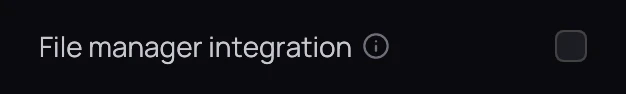

## What it is for

Kaveo can add itself to your desktop, so a video you have just downloaded is one right-click away
from playing, or from being filed into your library.

## How to use it

1. Turn on **File manager integration** in **Settings › Interface**
   ([Interface](settings/interface.md)). It acts at once; there is nothing to save.
2. Right-click a video and open it with Kaveo, or choose **Add to Kaveo's queue** from its
   **Kaveo** submenu — see [Next episode and queue](watching/next-episode.md).
3. From that submenu, **Add to Movies (move)** files it into a category and renames it to match your
   library; **Add to Movies (link, keep the original)** leaves the original where it is.
4. On a folder, **Play this folder with Kaveo** plays every video in it in order, and the same
   **Add to** entries file the whole folder.

## Good to know

- The **Kaveo** submenu comes from KDE: Dolphin shows it, GNOME Files and Thunar do not, though
  opening a video with Kaveo still works there.
- If Kaveo moves or is installed again, the setting reads off — turn it back on so the menus find
  it. Turning it off removes everything it added, and never makes Kaveo your default player.
- Filing happens at once; Kaveo asks only when something needs deciding, such as a file that would
  overwrite one already there. Only categories that accept films or series are offered. A video in a
  personal category's folder still gets them, but Kaveo refuses and says why.
