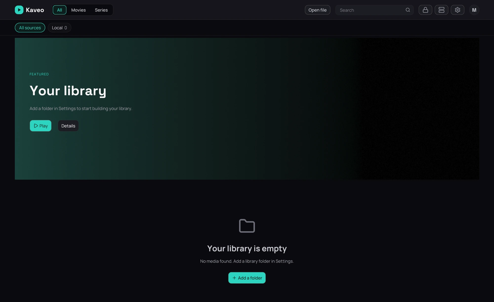
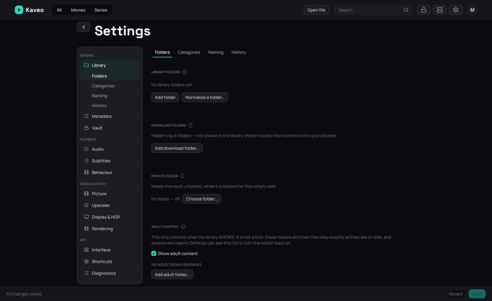

## What it is for

The first time Kaveo runs there is nothing to show yet — this is how you point it at your films and
shows, or just play one file with no library at all.

## How to use it

1. With nothing added, the library screen says **Your library is empty** — click **Add a folder**.
2. That opens **Settings › Library › Folders**; click **Add folder** and choose the folder your films
   or shows live in.
3. Click **Save** — the scan starts as soon as you do, and titles appear once it finishes.
4. Repeat for another folder, or split your library into kinds first — see
   [Categories](../library/categories.md).

## Good to know

- Drag a video onto the Kaveo window, or click **Open file** in the top bar, to play it right away —
  no library folder needed. Kaveo never becomes your default video player; adding it to your file
  manager's own right-click menu is a separate, opt-in step — see
  [From your file manager](../file-manager.md).
- A folder can be removed later from the same page; nothing on disk is touched — see
  [Local folders](../sources/local-folders.md) for what that page does.
- See [The library home](../library/home.md) for what the rows and the featured band do once titles
  appear.
