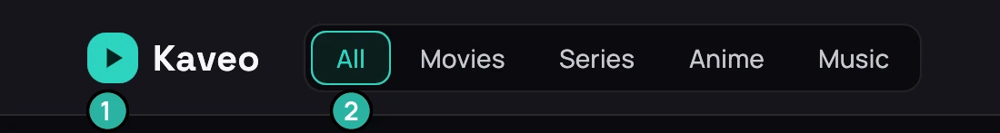
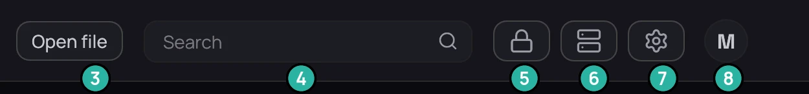
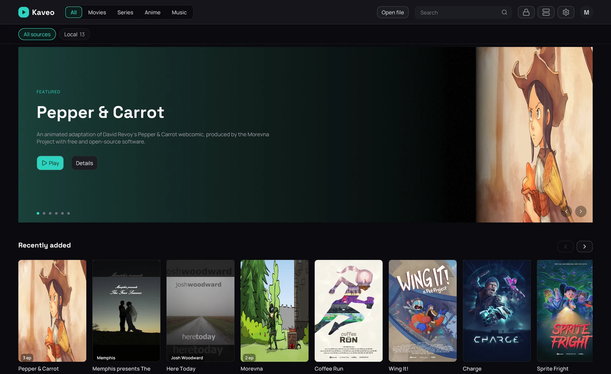
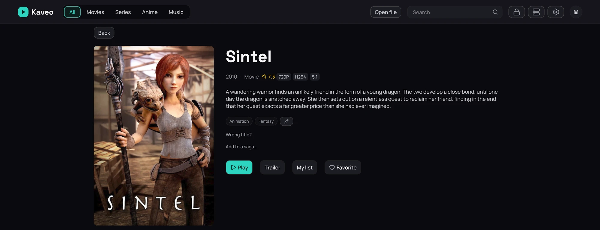
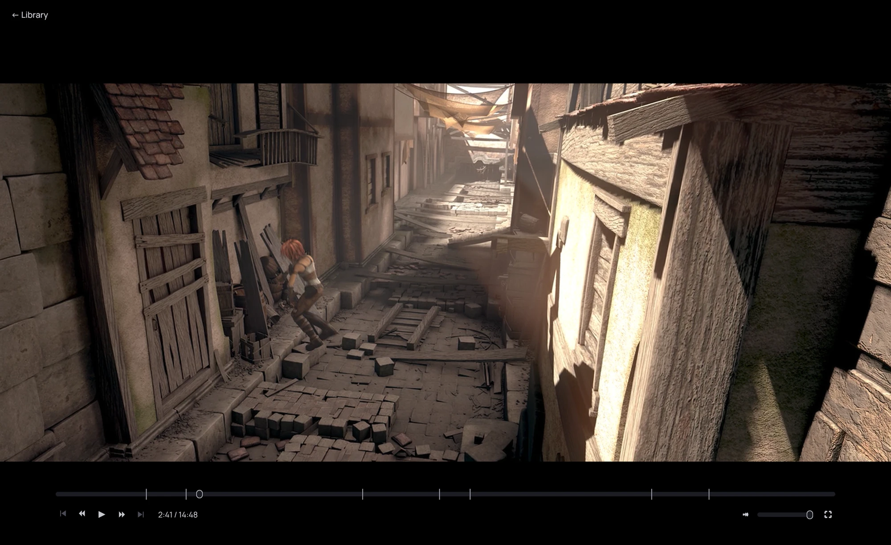

## What it is for

A map of the screens this guide keeps pointing at, so "the top bar" or "the playback bar" means
something the moment you read it.

## The top bar

1. The logo — back home, with every filter cleared.
2. Categories — your library's places; see [Categories](../library/categories.md).
3. **Open file** — play something outside your library.
4. Search — see [Search](../library/search.md).
5. The vault padlock — see [Private titles](../private/index.md).
6. Sources — see [Sources](../sources/index.md).
7. Settings — see [Settings](../settings/index.md).
8. Your avatar.

## The library home

Rows of titles under a featured band; click a card to open it — a genre or saga row's own title opens
everything in it — see [The library home](../library/home.md).

## A title page

Poster, description, genres, cast, and similar titles. **Wrong title?**
fixes a bad match — see [Correcting a wrong match](../library/correct-a-match.md). More than one
copy? The row under **Play** lists them — see [Several copies](../organizing/versions.md). A series'
page starts with **Play** or **Resume**, then **Trailer**.

## The player

Move the mouse to bring up the bar: seek, previous or next, play or pause, volume, fullscreen — see
[Player controls](../watching/player-controls.md). Subtitles and audio are in the right-click menu
instead.

## Good to know

- Press **F12** anywhere for a picture of what's on screen — see
  [Screenshots](../watching/screenshots.md).
- Type in the search field, or click a genre or saga row's own title, to narrow the grid to one thing.
