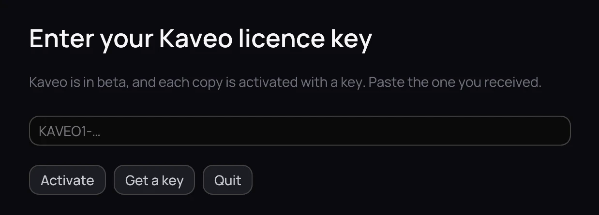

## What it is for

During the beta, each copy of Kaveo is activated with a licence key that lasts 30 days. You receive
it by email.

## How to use it

1. Copy the whole key, which starts with KAVEO1-, and paste it into the field.
2. Click **Activate**.
3. **Settings › About** shows who the licence is for and until when; **Change key…** enters a new one.

## Good to know

- In its last week, a small badge in the top bar and one message say when it ends.
- When it ends, Kaveo shows only this screen until a new key is entered. A film you are watching
  plays to its end first. Nothing is deleted.
- Kaveo confirms the date online at least once a week. Without a connection for longer, or with the
  clock set back, it asks you to connect once and click **Try again**.
- To ask for a key, click **Get a key**.
