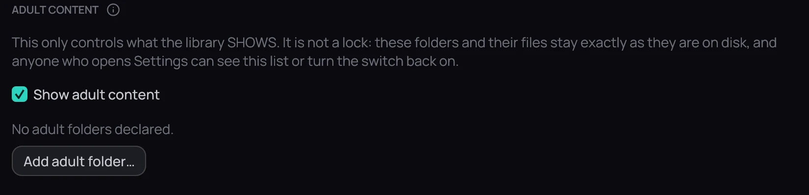

## What it is for

Hide titles tagged adult from every library screen — the rows, the grid, search and
*Recently played* — without touching the files themselves.

## How to use it

1. Open **Settings › Library › Folders** and find **Adult content**.
2. Click **Add adult folder…** and pick a folder; everything under it is tagged adult automatically.
3. Untick **Show adult content** and click **Save**.
4. Tick **Show adult content** again to bring them back exactly as you left them.

## Good to know

- It is a visibility switch, not a lock — Settings itself stays fully reachable, so it will not keep
  anyone out of it.
- To tag one title without a whole folder, right-click its card and choose **Mark as Adult**.
- Nothing is encrypted and nothing on disk moves.
