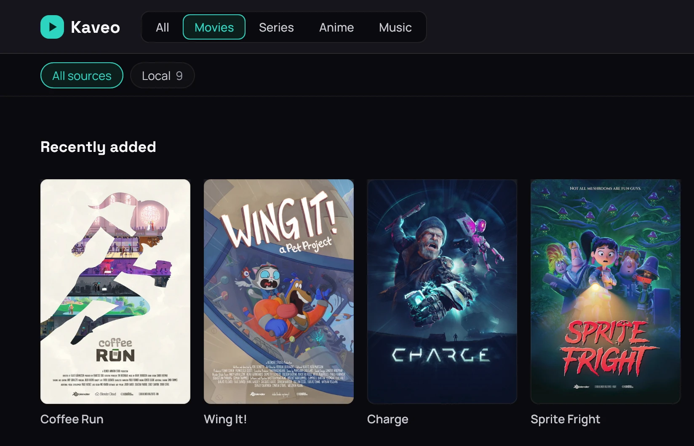
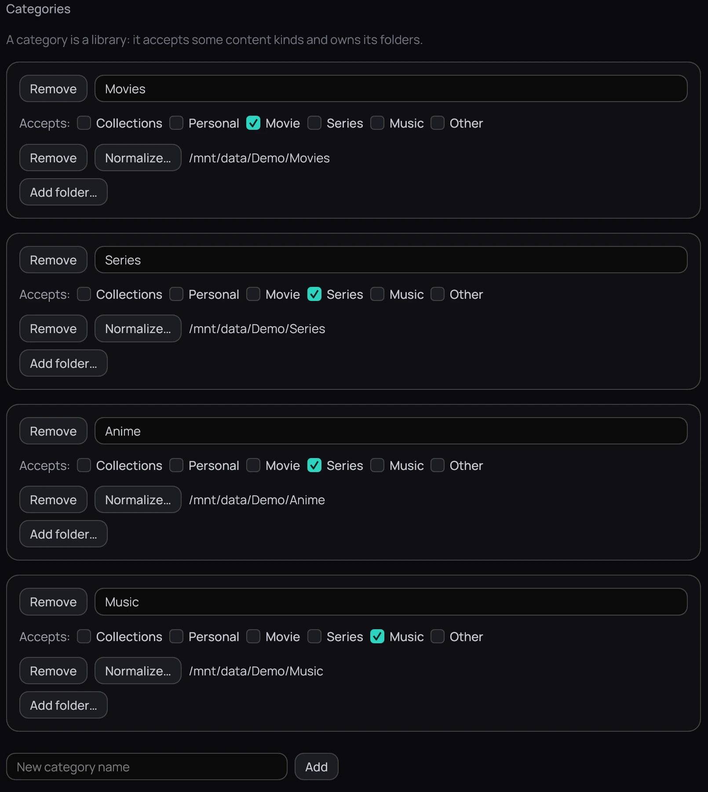

## What it is for

A category is a library of your own inside Kaveo — *Movies*, *Series*, or anything you like — naming
the folders and kinds of content it holds, so you can go straight to the part of your collection you
want.

## How to use it

### Visit a category

1. Click a category's name at the top of the library.
2. Browse its own rows, narrowed to what belongs there.
3. Pick a source in the bar underneath to narrow further.

### Create and manage one

1. Open **Settings › Library › Categories**, type a name under **New category name**, and click **Add**.
2. Beside **Accepts:**, tick which kinds of content it holds — none ticked means everything.
3. Click **Add folder…** to give it a folder to scan, or **Remove** beside its name to delete it.

## Good to know

- Changes apply at once — there is no **Save**, and **Revert** cannot undo them.
- Removing a category never touches the files on disk.
- A server's library is mapped into a category from its connection wizard.
- An empty category says why: a folder it cannot read is named, with **Edit the category** beside it.
