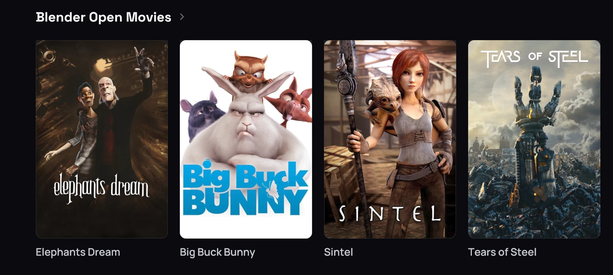
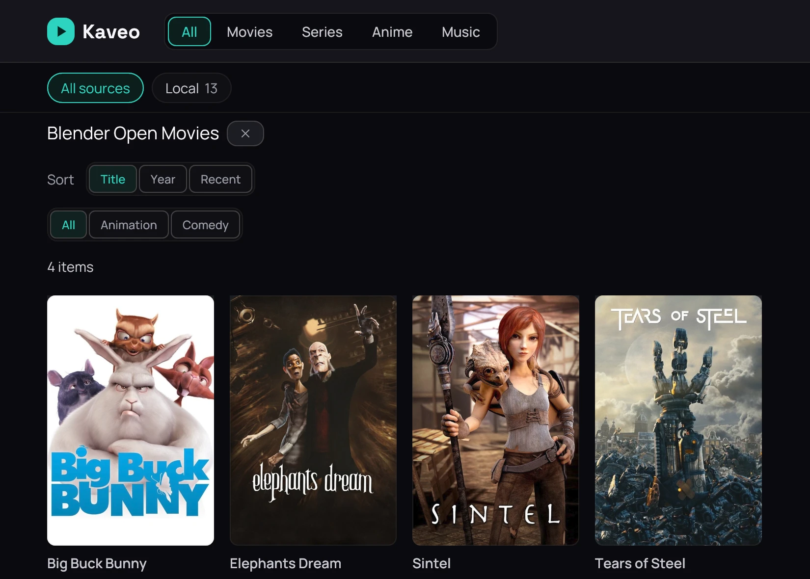
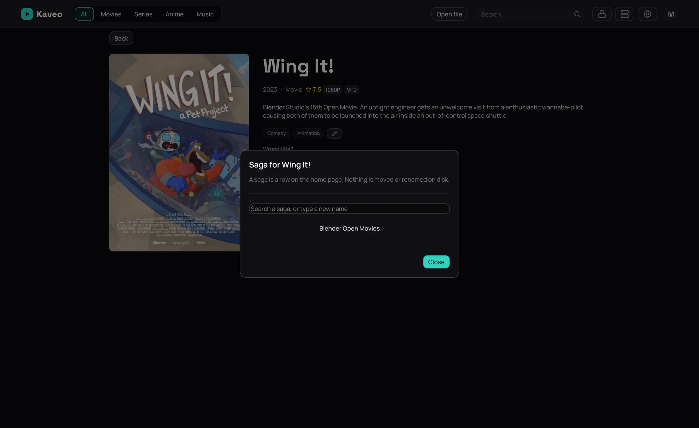

## What it is for

A saga groups titles that belong together. When you own two or more titles of one saga, the home gets
a row for it.

## How to use it

### See the whole saga

1. Click the row's title to see the whole saga.

### Add a title to one

1. Right-click a card and choose **Add to saga…** to add a title.
2. Pick a saga from the list, or type a new name and click **Create “…”**.

## Good to know

- Sagas come from NFO files, TMDB and your Jellyfin server; a series joins one only by hand.
- The picker withholds **Create** only when your text exactly matches a saga you already have — it
  does not hide any other saga.
- Nothing moves on disk.
