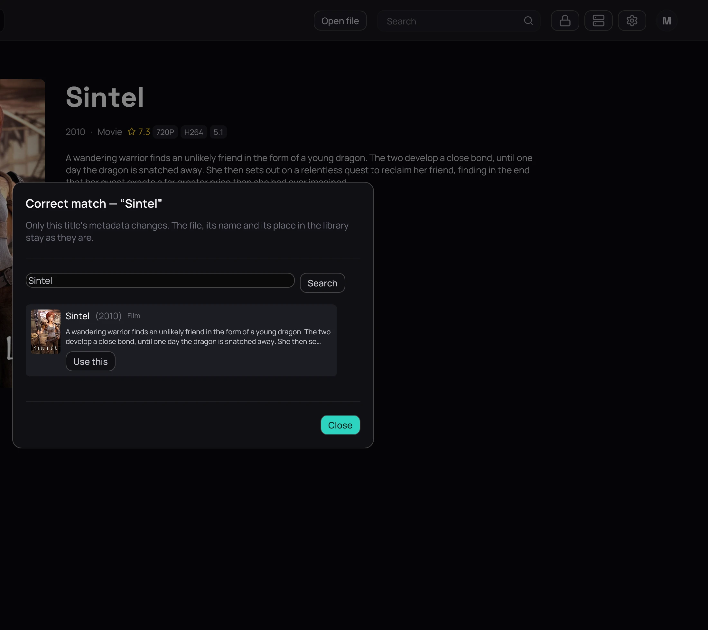

## What it is for

When a poster or a plot belongs to something else, Kaveo has matched a local title to the wrong film
or series — correct it by hand.

## How to use it

1. Right-click the card and choose **Correct match…**, or click **Wrong title?** on the title's page.
2. If the right one is not shown, change the search text and click **Search**.
3. Click **Use this** beside the right one.

## Good to know

- The match is pinned, so no later scan can undo it.
- Only the metadata changes — the file, its name and its place in your library stay put.
- To hand the decision back to Kaveo, open the same dialog and click **Restore automatic match**.
