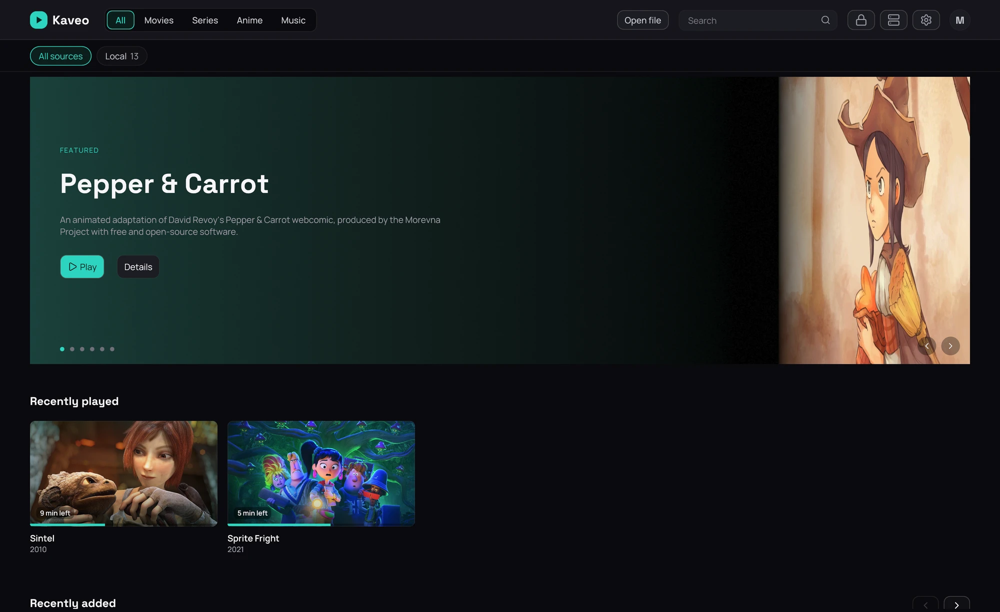
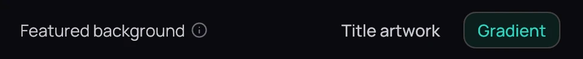

## What it is for

The home screen lays your titles out in rows so you find something to watch without hunting for a
file name, with a band at the top featuring a few of them.

## How to use it

### Open something

1. Rest the pointer on a card for a quick preview.
2. Click the card to open the title.
3. Copy a video into a library folder — it appears on its own, about ten seconds later.

### Choose the featured band

1. Open **Settings › Interface** ([Interface](../settings/interface.md)), under
   **Featured background**.
2. Pick **Title artwork** (each title's own image) or **Gradient** (Kaveo's colour wash).
3. Click **Save**.

## Good to know

- *Recently played* shows one card per title — a series stays on the episode you're partway through,
  then moves to the next one.
- **Title artwork** shows only once every title in the band has some; you see the gradient until then.
- The featured band is on the home screen only — a category or source page starts with its rows.
