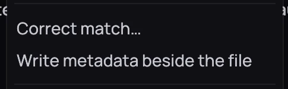

## What it is for

Kodi, Jellyfin, Emby and other tools keep what they know about a film or an episode in an NFO file
beside it. Kaveo reads those files, and writes them so a correction you make reaches every other
program.

## How to use it

1. Nothing to switch on — if your library already has NFO files, Kaveo uses them for the title, plot,
   genres and saga instead of guessing.
2. Right-click a film's card, or an episode's row on its series page, and choose
   **Write metadata beside the file**.
3. Look for the message naming the file Kaveo wrote.

## Good to know

- Kaveo will not touch an NFO file it did not write — it leaves another tool's file alone and tells
  you so.
- Writing happens only when you ask, one title at a time; an episode's file is written from its row,
  not the series card.
- Music's metadata lives in its own audio tags and is left out.
