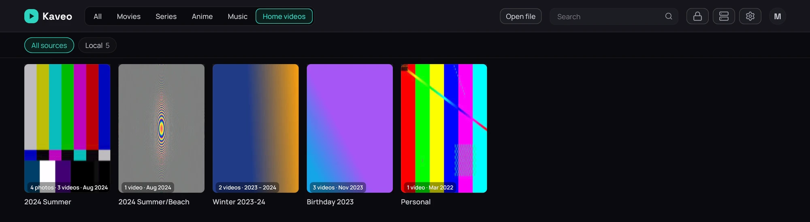
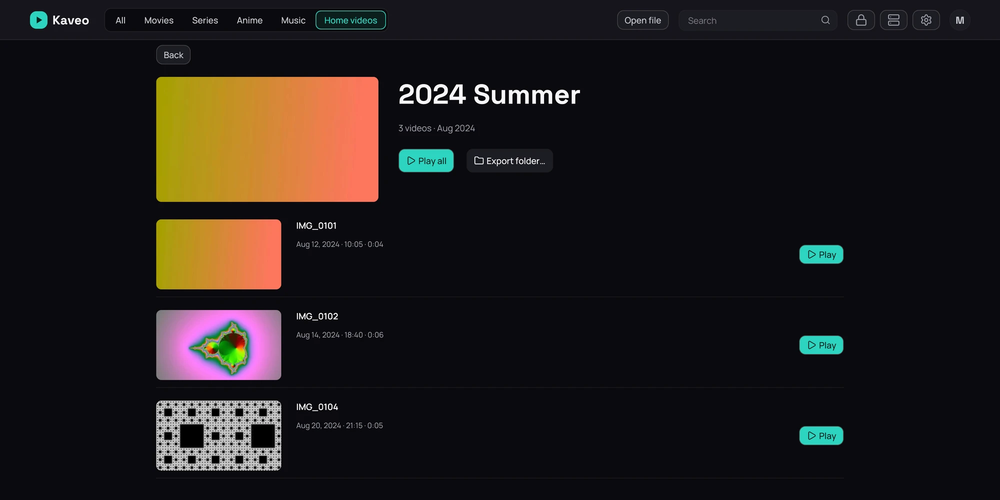

## What it is for

A personal category holds your own videos, from a phone or a camera, grouped by the folders you
already made and each played in the order it was filmed. They never appear on the home or among
films and series.

## How to use it

1. In **Settings › Library › Categories**, add a category, tick **Personal**, then click
   **Add folder…** and pick the folder of your videos.
2. Click the category at the top of the library, then a folder to open it.
3. Click **Play all**, or a video's own **Play** — each video plays into the next.

## Good to know

- Kaveo never renames, moves or looks up your videos online, and never files a download into this
  category.
- A video's date is the one the camera wrote, or else the file's own.
- Photos, the short video an iPhone keeps with each Live Photo, and AVCHD camera files are not shown
  yet.
