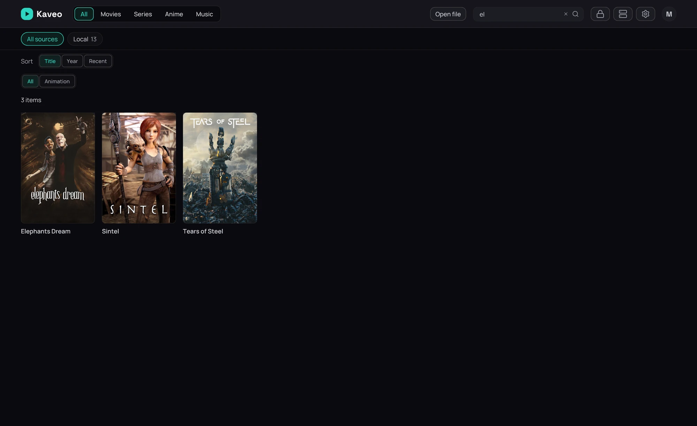
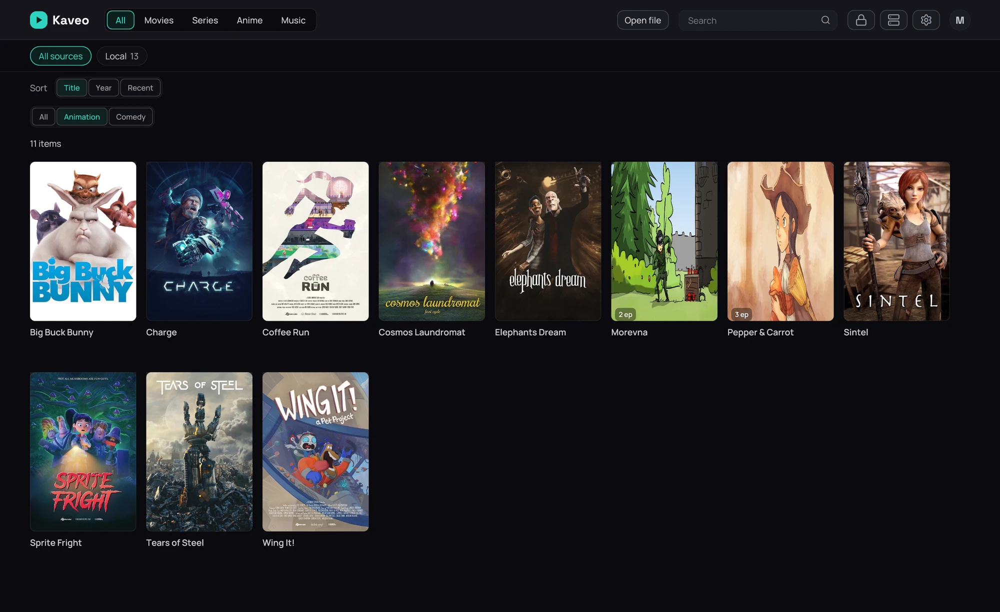

## What it is for

Search, or click a genre, to see a plain list of titles instead of the home's rows — a result you can
sort and narrow further.

## How to use it

### Search or open a genre

1. Type in the search field, or click a genre row's title on the home screen.
2. Look over the grid of cards that comes back.
3. To start over, click the cross at the end of the search field (**Clear search**).

### Narrow it further

1. Click a chip above the grid — *All*, or a genre or tag — to narrow the list further.
2. Use the sort control to reorder the list by **Title**, **Year** or **Recent**.

## Good to know

- A category or a source is a *place* and keeps the home's rows; a search or a single genre is a
  *result* and gets this list.
- The chips show only the genres and tags your current list actually contains.
