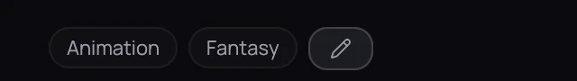
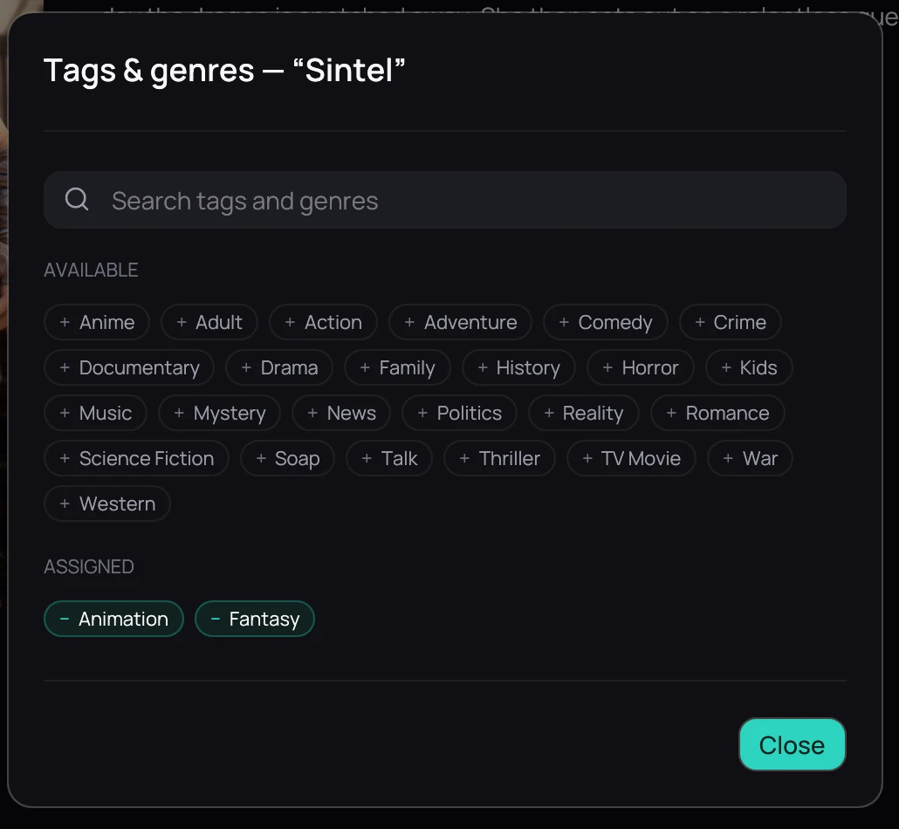

## What it is for

Every title carries genres, plus two tags of Kaveo's own, **anime** and **adult**. Kaveo fills them
in for you and lets you correct any of them.

## How to use it

### See a title's tags

1. Open a title's page to see its genres and tags.

### Correct them

1. Click the pencil (**Edit tags and genres**) to open the searchable list — an anime title's entry
   explains why, for example *Detected as anime: animation, in Japanese.*
2. Click an entry under **Available** to add it, or under **Assigned** to remove it.
3. Type a name and click **Add “…” as a genre** for one the list does not have.
4. Click **Restore automatic classification** or **Restore automatic genres** to hand a decision back
   to Kaveo.

## Good to know

- Right-click a card and choose **Mark as Anime** or **Mark as Adult** without opening the title.
- A correction you make is remembered — a later rescan will not undo it.
- **Settings › Metadata › Recatalogue library** ([Metadata](../settings/metadata.md)) clears the
  cached metadata and starts over.
