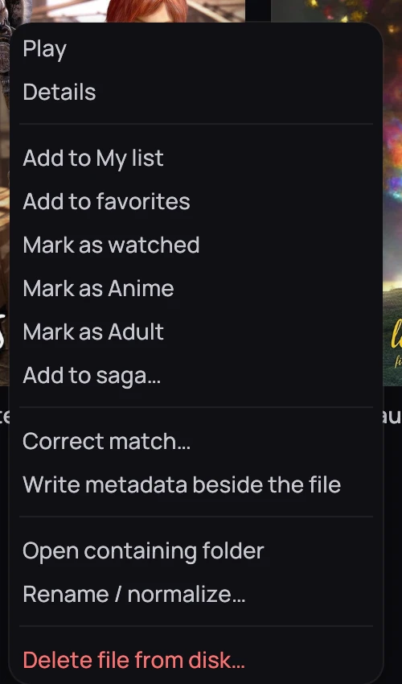

## What it is for

Right-click a card for the everyday actions on that title — play it, tag it, or manage its file —
without opening its page first.

## How to use it

1. Right-click a card to open its menu.
2. Choose **Play**, or, for example, **Resume from 12:34** / **Play from the start** if you stopped
   partway through.
3. Choose **Details** to open the title's own page.
4. Choose **Add to My list**, **Add to favorites**, **Mark as watched**, **Mark as Anime**,
   **Mark as Adult** or **Add to saga…** to file or tag it.
5. For a local file, choose **Rename / normalize…**, **Open containing folder** or
   **Delete file from disk…**.

## Good to know

- An episode's own actions are on its row on the series page, not on the series card's menu.
- **Delete file from disk…** permanently removes the file; Kaveo asks you to confirm first.
- A file watched almost to the end is marked as watched automatically.
