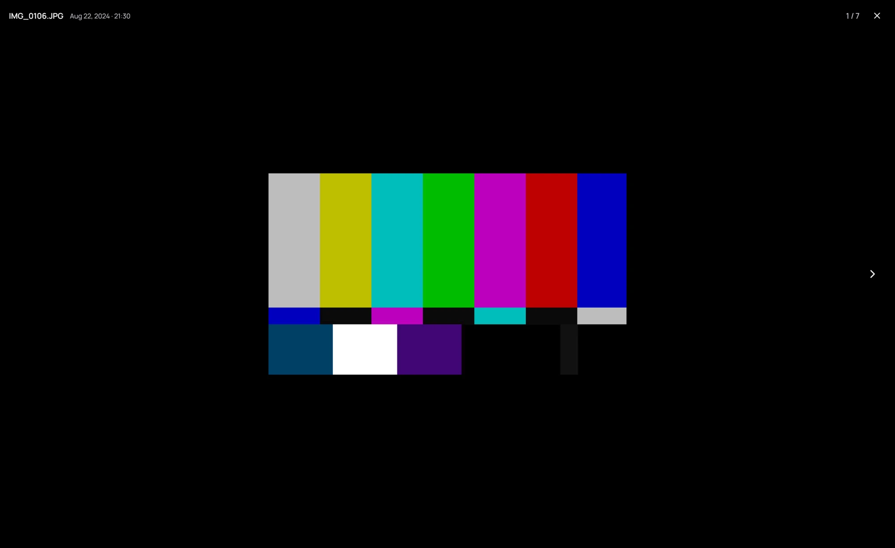
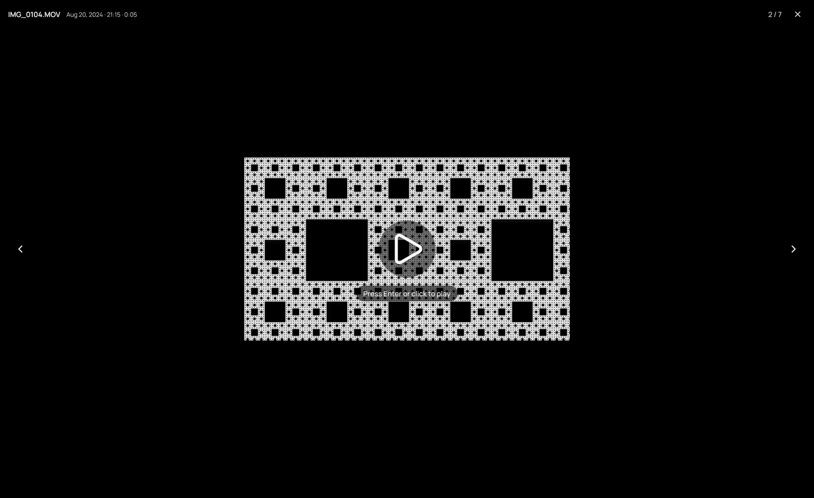

## What it is for

A click on a photo in one of your own folders opens it on its own, on black, with its name, its date
and its place in the folder across the top.

## How to use it

1. Turn the mouse wheel to zoom toward the pointer, and drag to move around. The spot under the pointer stays put once the photo is larger than the window.
2. Double-click to see the photo at its actual size, and again to fit it back.
3. Press **→** or **←** to go through the folder, newest first. A video stops you: its picture shows, and nothing plays.
4. Press **Enter** or click the video to play it. **Esc** in the player, or the end of the video, brings you back to it; in full screen, the first **Esc** only leaves full screen.
5. Press **Esc**, or click the close button at the top right, to return to the folder.

## Good to know

- Opening a photo stops a video that was still playing in the background.
- A photo that cannot be shown says why, and keeps its place in the folder.
- A Live Photo carries a **LIVE** badge. Its motion does not play yet.
