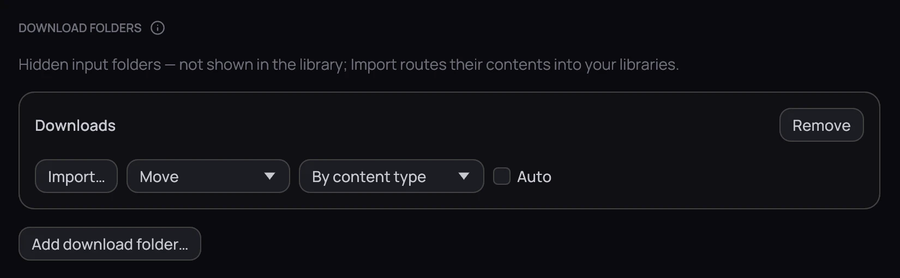
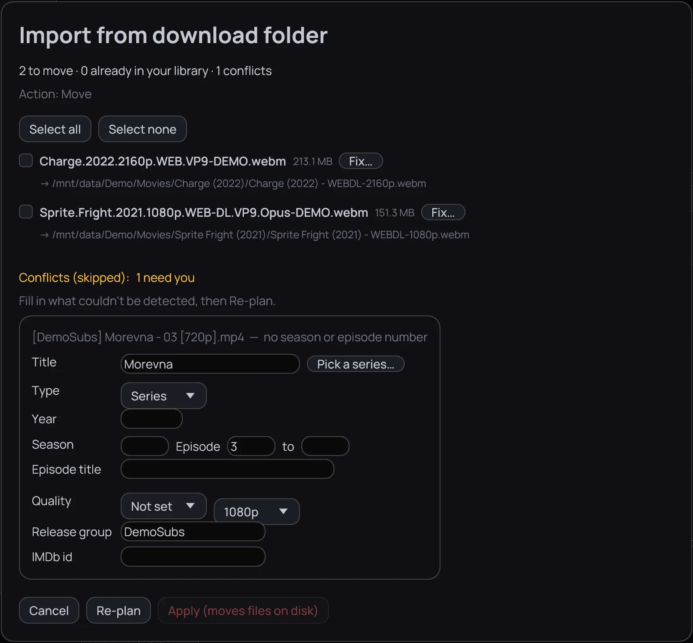

## What it is for

Kaveo files finished downloads into your libraries, named by your
[templates](naming-templates.md). A download folder is an input only: Kaveo does not scan it as a
library folder, and anything still downloading stays behind.

## How to use it

### Add a download folder

1. In **Settings › Library › Folders**, under **Download folders**, click **Add download folder…**.
2. On its card, choose **Move** or **Hardlink (keep original)** and where the files go —
   **By content type**, or one category if this folder always feeds the same library.
3. Click **Save** — nothing on the card counts until you do.

### Import what is in it

1. Click **Import…**, then **Preview** if Kaveo asks where each kind goes.
2. Tick the files you want, or click **Select all**, then **Apply (moves files on disk)** — or
   **Apply (links them, keeps the originals)** for a hardlink folder.

## Good to know

- **Hardlink (keep original)** keeps your torrent client seeding, but only within one drive: a file it
  cannot link is skipped, not copied.
- Kaveo never overwrites a file already at the destination, and a file it cannot name is listed as a
  conflict instead — see [Fixing an import](fix-an-import.md).
- Tick **Auto** and click **Save** to import with no preview from then on — but nothing then says
  what it left behind: untick **Auto** and click **Import…** to see those files.
