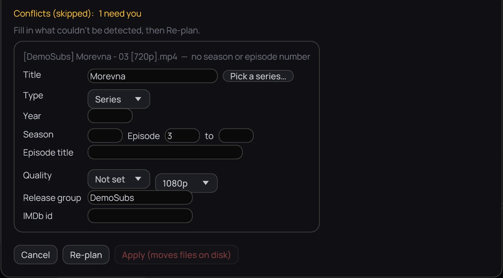

## What it is for

Kaveo lists a file it cannot name as a conflict instead of guessing. Answer what is missing before
anything moves.

## How to use it

1. In the preview, find *Conflicts (skipped):* — a count says how many rows need you, and each card
   names a file and what is missing.
2. Fill in the form already open under it; for a series, click **Pick a series…** to choose one you
   already have rather than retyping its name.
3. Click **Re-plan** to see the new names. **Fix…** opens the same form on any other row, even one
   Kaveo planned successfully.
4. Click **Apply (moves files on disk)** once the rows you care about are resolved.

## Good to know

- A token Kaveo cannot fill — an episode title with no TMDB key, say — is asked for the same way; a
  token inside an optional part is never asked about.
- **{MediaInfo …}** tokens get no box: they are read from the file. Check that FFprobe is installed,
  or take the token out of the template.
- Samples and bonus material are never imported, and never listed. A file still downloading is left
  out, and the preview says how many — import again once it has finished.
