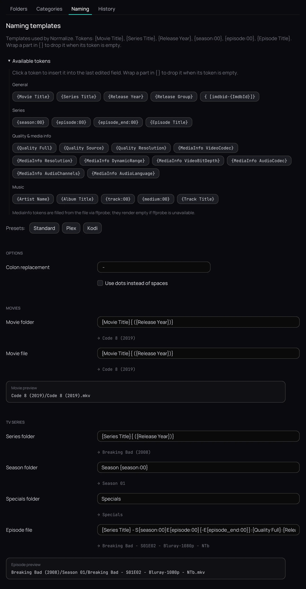
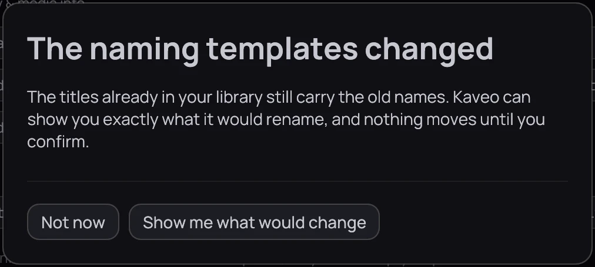
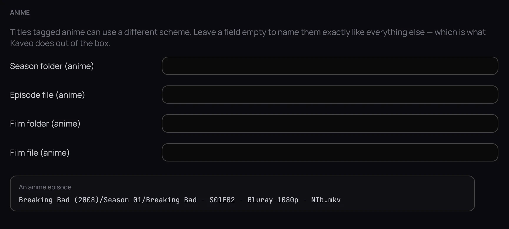

## What it is for

Naming templates describe the layout Kaveo renames files into — on import, and when you tidy a
library folder.

## How to use it

### Set your templates

1. Open **Settings › Library › Naming**. A preset — **Standard**, **Plex** or **Kodi** — replaces
   every field except **Music naming**, the **Anime** ones included.
2. Edit a template under **Movies**, **TV Series** or **Music naming**: click in a field, then click
   a token under **Available tokens** to add it to the end.
3. Under **Options**, set **Colon replacement**, **Episode title language** (**English** or **Same as the
   interface**) and **Use dots instead of spaces**.
4. Click **Save**. *The naming templates changed* then offers **Show me what would change** —
   a preview across your whole library — or **Not now**.

### Name anime differently

1. Under **Anime**, fill in **Episode file (anime)** — for example
   **{Series Title} - {episode:00}**.
2. Leave the other three empty to name anime like everything else, then click **Save**.

## Good to know

- A token is typed exactly as shown, such as **{Movie Title}**; wrap a part in another pair —
  **{ ({Release Year})}** — to write it only when its token has a value.
- **{Quality Full}** turns a release's own words into one name, such as *Bluray-1080p*: the source is
  read from the file's name, then its folder, and the picture size is measured from the file.
- With a TMDB API key (**Settings › Metadata**; [Metadata](../settings/metadata.md)), titles are
  filed under their official English names rather than the ones read from the files.
