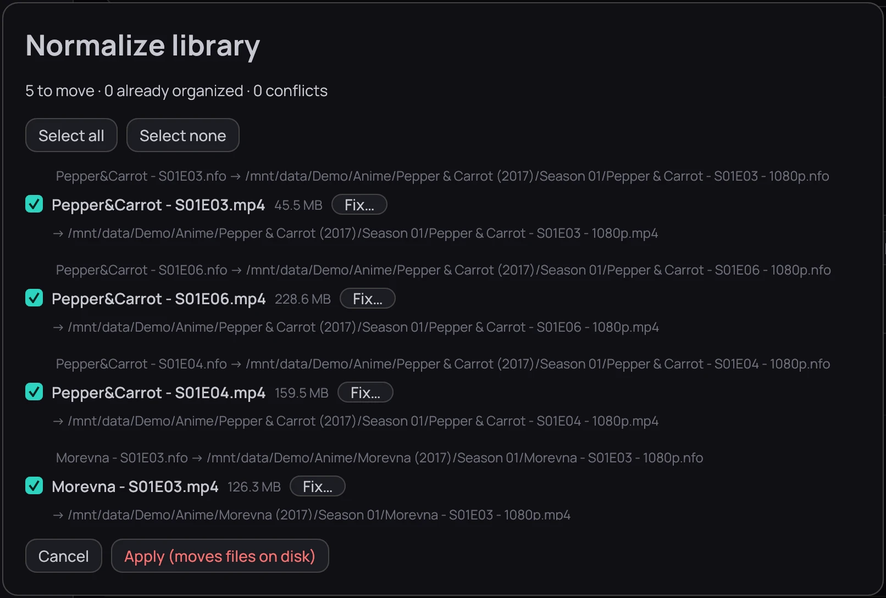

## What it is for

A new naming template is never applied to what is already in your library. Tidying brings a folder
in line, and shows you the list before anything moves.

## How to use it

1. Click **Normalize…** on a folder's card in **Settings › Library › Folders**, or beside a
   category's folder in **Settings › Library › Categories**; for one film right-click its card,
   for one episode its row on the series page, and choose **Rename / normalize…**.
2. Kaveo reads any file it has not seen before (*Preparing the preview*); **Cancel** stops it, and
   nothing has moved.
3. In the *Normalize library* list, untick a row to leave it out, or use **Select all** /
   **Select none**.
4. Click **Fix…** beside a row Kaveo read wrong, correct it, then click **Re-plan**.
5. Click **Apply (moves files on disk)**.

## Good to know

- Subtitles, artwork and the NFO file travel with the rename, and so do the title's saved position,
  its card in *Recently played*, and your corrections.
- A file Kaveo could not place is listed as a conflict with its reason; see
  [Fixing an import](fix-an-import.md) for the ones you can answer.
