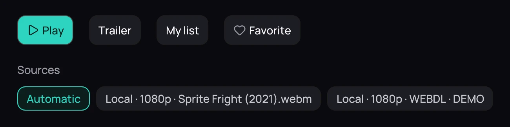
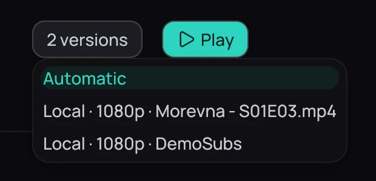

## What it is for

The same film or episode can exist twice — two releases, or a local file and the same title on your
Jellyfin server. Kaveo keeps them as one title with several versions, and remembers the kind you
prefer.

## How to use it

1. Open the list: the chips under *Sources* on a film's title page, or the versions button beside an
   episode's **Play**, for example **2 versions**.
2. Each copy says where it is (*Local* or Jellyfin), its resolution, and what tells it apart — where
   the release came from and its release group, or the file name.
3. Click the copy you want: that selects it, it does not start it.
4. Click **Play** to open it.

## Good to know

- A film on your disk and the same film on a server are one card, not two; with only one copy there
  is no list to open.
- Your choice is remembered for the title — for a series that means every episode of it, and it still
  holds the next time you open the show.
- Choose **Automatic**, first in the list, to forget your choice and go back to the best copy.
