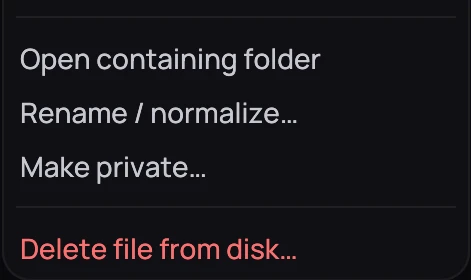
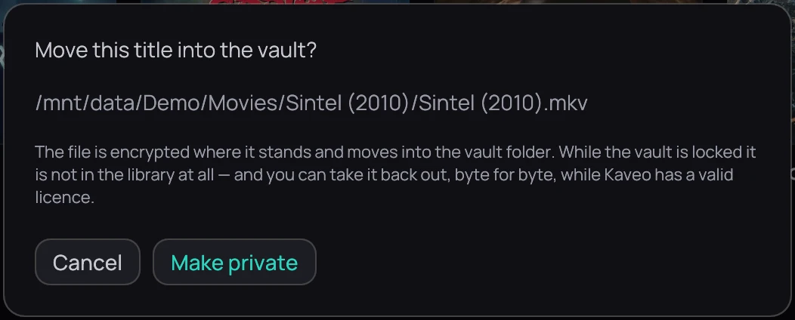

## What it is for

Make a local title private — encrypted where it already sits, and out of your library while the vault
is locked.

## How to use it

1. [Unlock the vault](lock.md), then right-click the card of a local film or episode and choose
   **Make private…**.
2. Check that the path is the file you meant, then click **Make private**.
3. For a file that is not in your library, open the padlock menu and choose
   **Make a file private…**.
4. Drop a video into your private folder (set one under **Private folder** in
   **Settings › Library › Folders**) and Kaveo hides it once the copy finishes; while the vault is
   locked, the files wait.

## Good to know

- On the same drive the film is moved, not copied. Encrypting needs its own size again in free
  space, or about 16 MB to encrypt it where it lies.
- Its subtitles, its NFO file and every picture whose name starts with the video's — artwork, saved
  frames, your own photos — travel with it, in and out. The dialog counts them; one that cannot go
  in stays put, and the message after the hide says how many.
- A film's [saved frame](../watching/save-a-frame.md) stays in Pictures, under the film's name, once
  the film is hidden.
- If Kaveo closes during a hide, your next unlock finishes it or puts the film back, and says so.
- You can take it back out, byte for byte — see
  [Taking a title back out](take-a-title-out.md).
