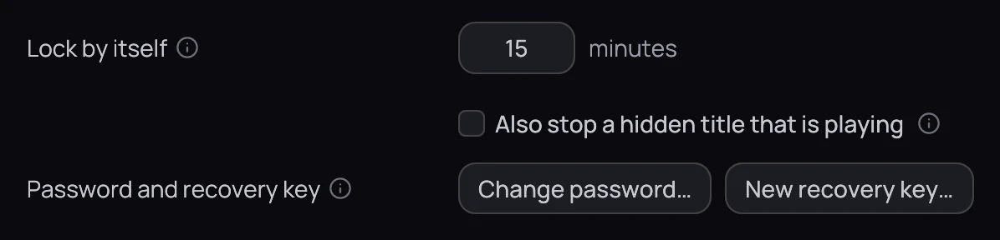

## What it is for

The vault locks itself after a while so you do not have to remember, and its password can be changed
without touching the films inside.

## How to use it

### Locking

1. Open the padlock menu and choose **Lock now** to lock immediately — if a film is on screen Kaveo
   asks first: playback carries on, but every hidden title leaves the library around it.
2. Or leave it: the vault locks itself after 15 minutes idle by default — playing a title counts as
   activity, so it never locks in the middle of one.

### Unlocking

1. Click the padlock and type your **Password** — or click **Use recovery key instead** and give
   the key.
2. Click **Unlock**. Your private titles are back in the library.

### Changing your password

1. Unlock the vault, then open **Settings › Vault** ([Vault](../settings/vault.md)) and click
   **Change password…** — it is greyed out while the vault is locked.
2. Enter your current password (or your recovery key), the new password twice, then click
   **Change password**.

## Good to know

- Your recovery key still works after a password change — it opens the vault on its own. To retire
  it, unlock the vault, click **New recovery key…** and give your password or the old key; the old
  one stops working at once.
- Set **Lock by itself** to 0, in **Settings › Vault**, to turn the timeout off.
- Locking is built against someone browsing your library or files, not against forensic recovery of
  the drive.
