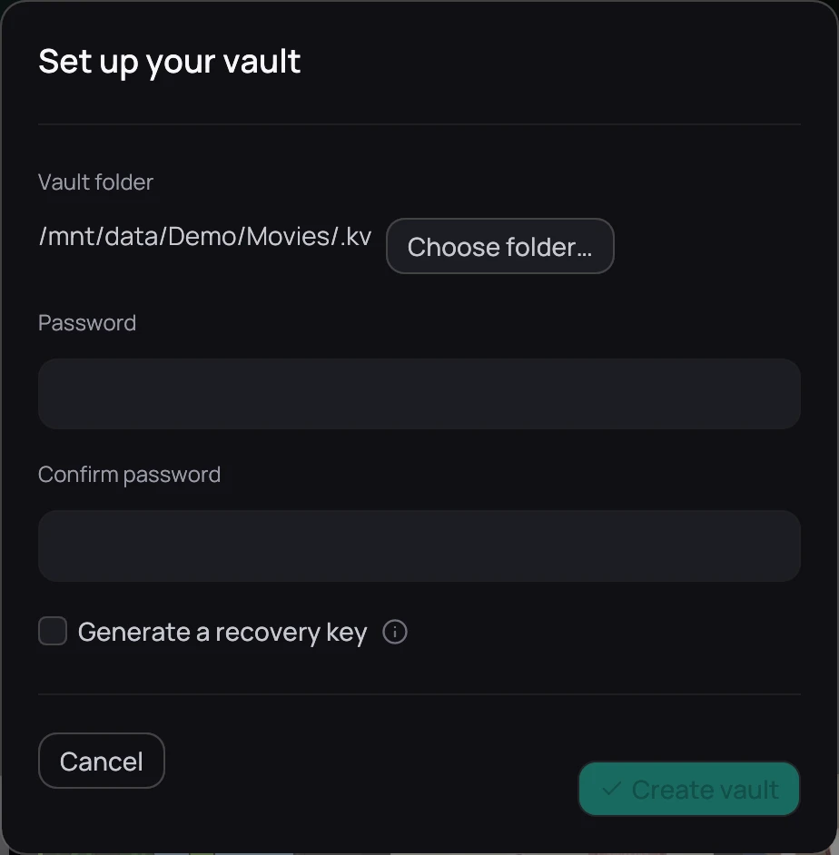

## What it is for

Before you can hide anything, Kaveo needs a vault: a folder to keep hidden titles in, and a password
to lock it with.

## How to use it

1. Click the padlock icon in the top bar. With no vault yet, it opens **Set up your vault**.
2. **Vault folder** is filled in for you if you already have a library folder — keep it, or pick
   another with **Choose folder…**, on the same drive as your films so hiding a title later is
   instant instead of a copy across drives.
3. Fill in **Password** and **Confirm password**, tick **Generate a recovery key**, then click
   **Create vault** — grey until a folder is set and the two passwords match.
4. Write down the recovery key — shown once, with **Copy** to put it on the clipboard — then tick
   **I have written it down** and click **Done**.

## Good to know

- Your password is never stored, not even as a hash. Without it and without the recovery key, nothing
  inside can ever be opened again — nobody can reset it for you.
- The recovery key unlocks the vault on its own, independently of the password, so keep it somewhere
  safe.
