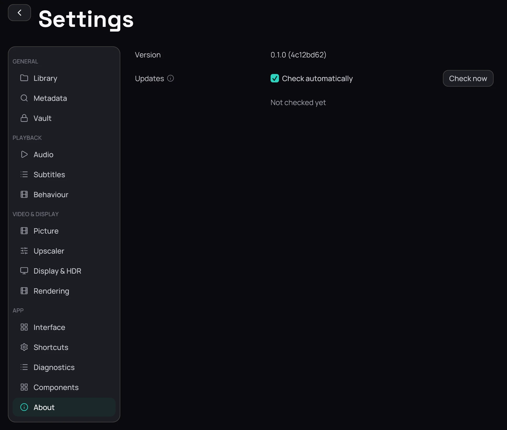

## What it is for

**Settings › About** carries one line — *Kaveo version* and the number you are running. There is
nothing else in the section.

## How to use it

1. Read the version line.
2. Quote it in a bug report, alongside a bundle from [Diagnostics](diagnostics.md).
3. See [Troubleshooting](../troubleshooting.md) for what to send with a report.
