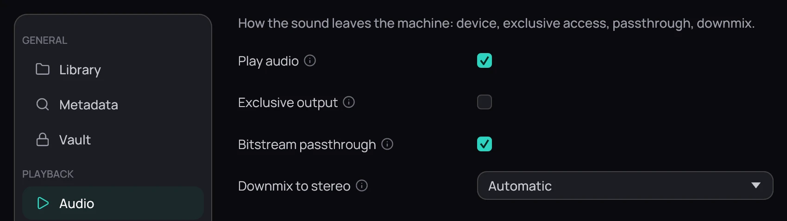

## What it is for

**Settings › Audio** decides where the sound goes, whether Kaveo takes that output for itself, and
what happens to a film with more channels than your speakers.

## How to use it

1. **Play audio** is on to begin with; turn it off to watch the picture silently.
2. Tick **Exclusive output** for bit-perfect sound that bypasses the system mixer.
3. **Bitstream passthrough** is on too: Dolby and DTS reach a receiver untouched, and arrive
   decoded where the output cannot carry them.
4. Set **Downmix to stereo** to **Automatic**, **Never** or **Always**; **Automatic** folds only
   when the output has fewer channels than the film.
5. Pick an **Audio output device** in the last row, or leave it on **System default**. On
   **System default**, if your system's output is an HDMI one, passthrough still reaches it.

## Good to know

- Neither **Exclusive output** nor **Bitstream passthrough** says what your output can do:
  passthrough it cannot carry arrives decoded, and exclusive access it cannot get can leave a film
  silent. The player reports both.
- Pinning a device bypasses the sound server, so its channel count cannot be read and **Automatic**
  stands down; **Use a different setting for this output** gives it a **Rule for this output**
  instead, and **Remove the rule** drops it.
- Everything waits for **Save** ([Saving changes](saving.md)); tracks and **Audio delay** belong to
  the player ([Audio and subtitle tracks](../watching/audio-and-subtitle-tracks.md)), and the last
  group of rows to [Volume and dynamics](../watching/volume-and-dynamics.md).
