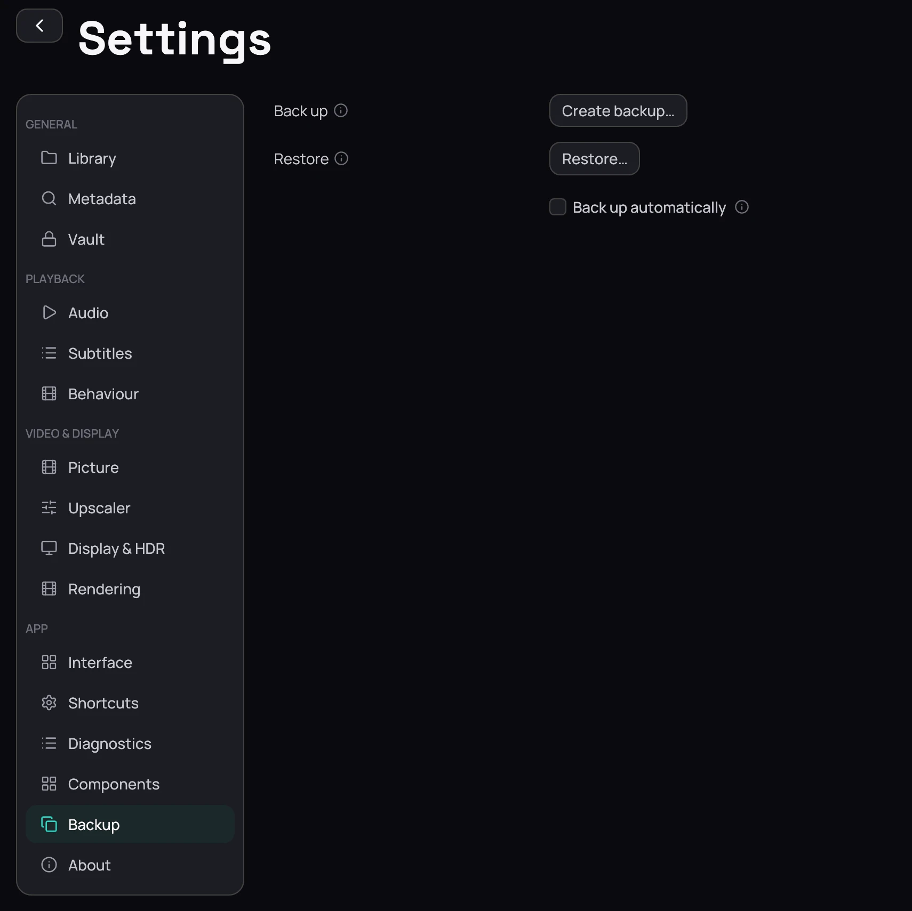

## What it is for

A backup keeps what you built in Kaveo — settings, categories, corrected titles, history, resume
points, the translation queue and your subtitles — in one file you can keep safe or carry to another
computer.

## How to use it

1. Open **Settings**, then **Backup**.
2. Choose **Create backup…** and pick where to save the file.
3. To bring one back, choose **Restore…** and pick the file.
4. Check the date and version it shows, then choose **Restore and restart**.

## Good to know

- Passwords, keys and server sign-ins are never in a backup: after a restore, sign in again. Your
  videos are not in it either.
- A restore replaces what you have; Kaveo first moves your current state into a folder it names, so
  it can be undone by hand.
- The list of private titles on this computer is never replaced by an older one from a backup.
