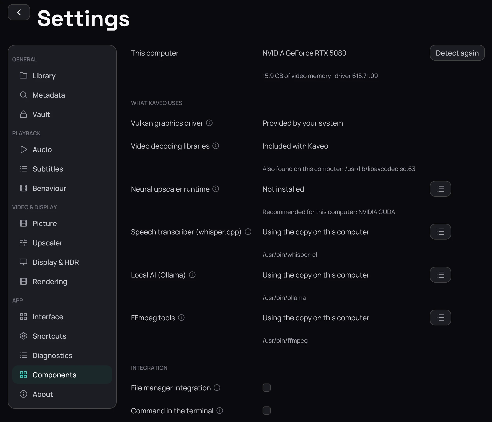

## What it is for

**Settings › Components** shows what this computer has, what Kaveo uses of it — the video
libraries it brings, the neural upscaler's runtime, the speech transcriber, a local AI, the FFmpeg
tools — and what each one needs that is missing.

## How to use it

1. Read **This computer**: the graphics card every recommendation is made for.
2. Read each row of **What Kaveo uses**. Under it is the copy in use, or what is recommended for
   this computer; where something is not possible, the steps to fix it.
3. Click the list button at the end of a row for its choices: a copy already on the computer,
   **Leave it out**, or **Back to the default**.
4. After installing a driver or a program, click **Detect again**.
5. Under **Integration**, tick **Command in the terminal** to start Kaveo by typing kaveo — see
   [Command line](../command-line.md).

## Good to know

- A choice is kept at once, without **Save**; some take effect the next time Kaveo starts.
- The video libraries are always Kaveo's own: a copy found on the computer is listed, never used in
  their place.
