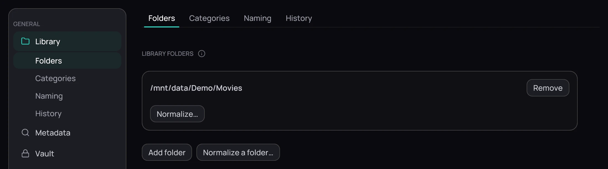

## What it is for

**Settings › Library** holds what is in your library and what it is called. Its four sub-pages —
**Folders**, **Categories**, **Naming** and **History** — appear in the rail and as tabs across
the page.

## How to use it

1. Open **Settings › Library › Folders** for the folder groups: **Library folders**
   ([Local folders](../sources/local-folders.md)), **Download folders**
   ([Download folders](../organizing/download-folders.md)), **Private folder**
   ([Hiding a title](../private/hide-a-title.md)) and **Adult content**
   ([Hiding adult content](../library/adult-content.md)). **Normalize a folder…**, beside
   **Add folder**, tidies one you pick — [Tidying a folder](../organizing/tidy-a-folder.md).
2. Open **Categories** for libraries of your own, with their folders and content kinds —
   [Categories](../library/categories.md).
3. Open **Naming** for the groups **Options**, **Movies**, **TV Series**, **Anime** and
   **Music naming**, the **Standard**, **Plex** and **Kodi** presets and the **Available tokens**
   reference — [Naming templates](../organizing/naming-templates.md).
4. Open **History** for the **Playback history** group and click **Clear history** to empty
   *Recently played*; it is greyed out with nothing to clear.

## Good to know

- Two sub-pages do not wait for **Save**: **Categories** applies and rescans at once, and
  **Clear history** empties the list on the click. **Revert** undoes neither.
- Clearing the history cannot be undone, but it does not forget where you stopped in a film.
