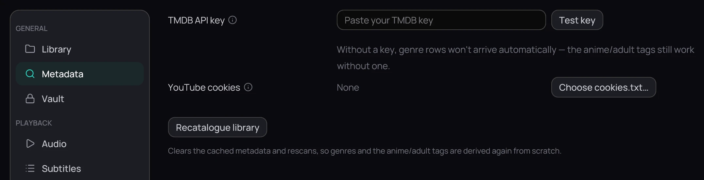

## What it is for

**Settings › Metadata** holds the key Kaveo uses to fetch posters, plots and genres, and the one
button that throws all of that away and fetches it again.

## How to use it

1. Paste your key into **TMDB API key**, then click **Test key** — it answers *Key works*, or names
   what went wrong.
2. Click **Save** to keep it: **Test key** only asks, and nothing reaches your key store before you
   save.
3. Set **YouTube cookies** with **Choose cookies.txt…** when a trailer preview stops because YouTube
   wants an age check; **Clear** removes it. Previews are chosen under [Interface](interface.md).
4. Click **Recatalogue library** to forget every cached poster, plot and genre and fetch them again.

## Good to know

- **Recatalogue library** acts on the click, and **Revert** does not undo it.
- With no key, your library and the anime and adult tags still work — only the genre rows stay
  empty, which Kaveo says under the field. See [Genres and tags](../library/tags.md).
- A wrong poster or plot is corrected on the title itself: see
  [Correcting a wrong match](../library/correct-a-match.md).
