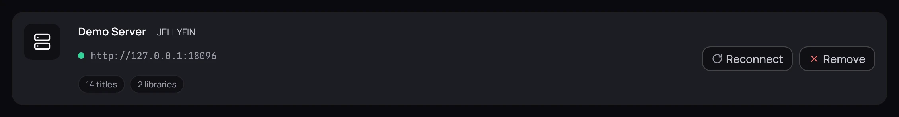
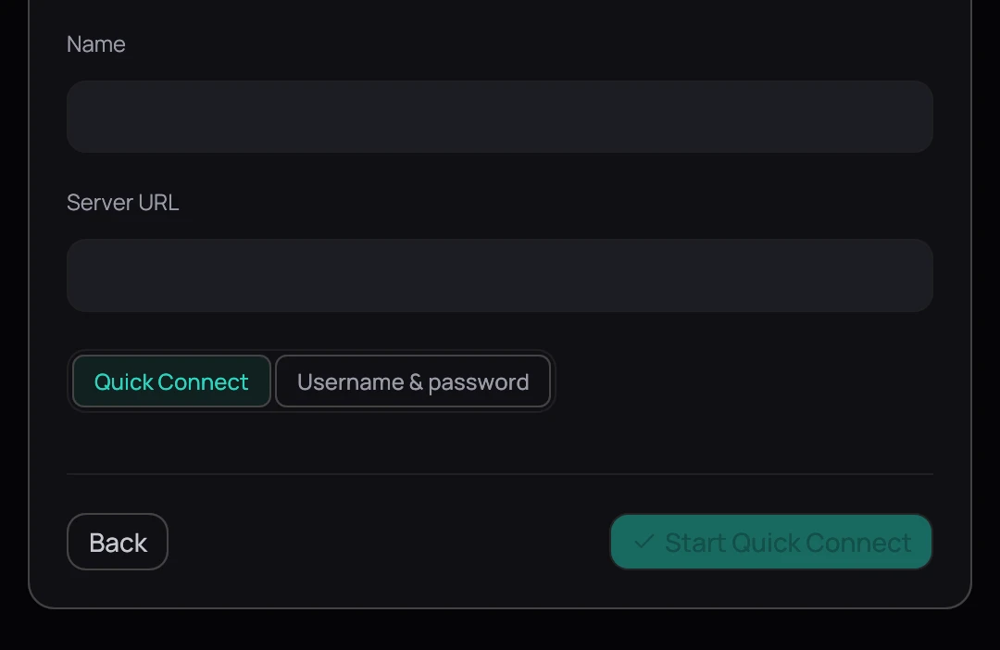
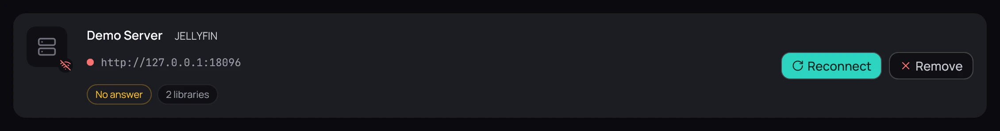
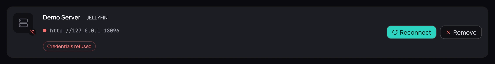
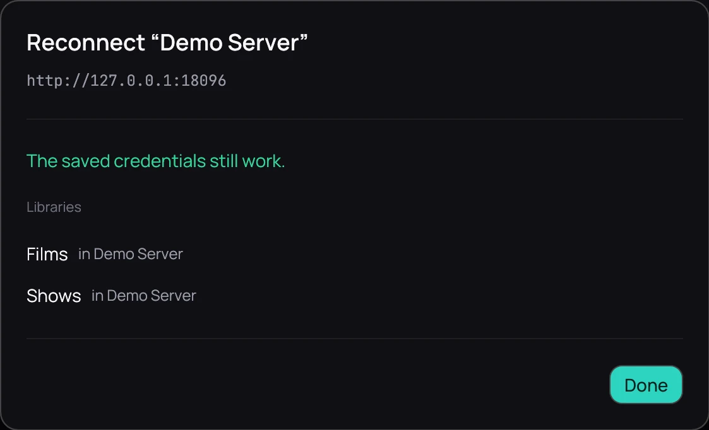

## What it is for

Kaveo plays a [Jellyfin](https://jellyfin.org/) server's films and series beside your local files,
and keeps your place in sync.

## How to use it

### Connect a server

1. Click **Sources** in the top bar, then **Connect a server** and **Jellyfin**.
2. Pick a server Kaveo found on your network, or type its address in **Server URL**; until it has
   one, **Start Quick Connect** and **Connect** stay dimmed.
3. Choose **Quick Connect**, click **Start Quick Connect**, and enter the code in your Jellyfin
   dashboard — or **Username & password** and **Connect**.
4. Map each of the server's libraries to **New category**, one of your categories, or
   **Don't import**.
5. Click **Done**. The server's titles join your library.

### When a server stops working

1. The **Sources** page gives every server a card saying what is wrong: *No answer* if the server
   is silent, *Credentials refused* if the sign-in no longer works. Either way it contributes no
   titles.
2. Click **Reconnect**, and sign in again if Kaveo asks; once the server answers it lists each
   library and the category it feeds.

## Good to know

- Your place and favorites travel both ways while Kaveo runs; watched travels only from the server.
- **Remove** asks nothing: it forgets the server and its sign-in, and drops a category left empty.
- If your computer has no password store, the **Sources** page says so: sign-ins are kept only until
  you restart, and every server then asks you to **Reconnect**.
