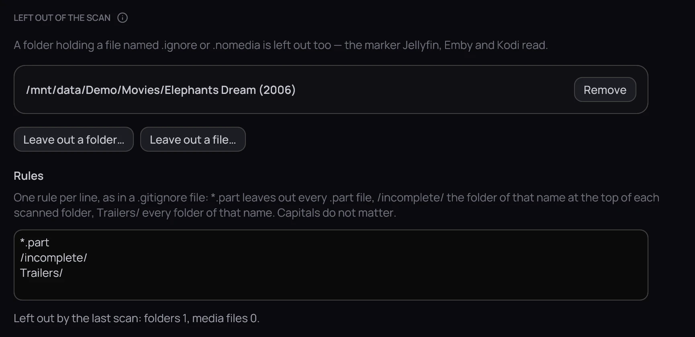

## What it is for

Some folders hold things that are not for the library — a download still in progress, a folder of
trailers, a film you keep but do not want listed. Kaveo can leave them out of every scan.

## How to use it

1. Open **Settings › Library › Folders** and scroll to **Left out of the scan**.
2. Click **Leave out a folder…** or **Leave out a file…** and choose it — or right-click a title's
   card and choose **Exclude from library…**.
3. Or write rules under **Rules**, one per line: *\*.part* leaves out every partial download,
   *Trailers/* every folder with that name.
4. Click **Save** — the library is scanned again, without them.

## Good to know

- Nothing on disk changes, and a file left out still plays when you open it directly.
- A folder holding a file named *.ignore* or *.nomedia* is left out too — the marker Jellyfin, Emby
  and Kodi read, so one file works for all of them.
- The rules hold for your download folders as well: a file left out is never imported.
