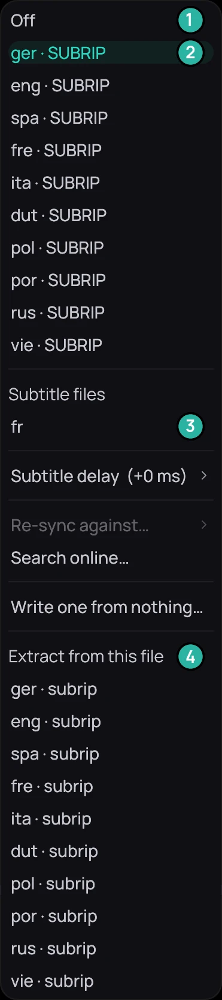

## What it is for

Play a subtitle file beside the video, a track inside it, or a file on your Jellyfin server. A file you
pick, or a track you extract, becomes your own copy to sync, edit or translate.

1. **Off**.
2. A track inside the video.
3. A subtitle file beside it.
4. *Extract from this file*.

## How to use it

1. While the video plays, right-click the picture, open **Subtitles** and pick a video track or a
   file under *Subtitle files*.
2. To add a file, save an SRT, ASS or WebVTT file beside the video with a name starting with the
   video's own, such as *Film (2016).ita.srt*.
3. To pull a track out, click it under *Extract from this file*. Kaveo reads the whole video, then
   lists the result under *Subtitle files*.

## Good to know

- A picture-based track, as on most Blu-rays, cannot be extracted: its row is greyed.
- On a Jellyfin title, the server's files are under *Subtitle files on the server*; click one to add
  it.
- A private title plays only the tracks inside its video.
