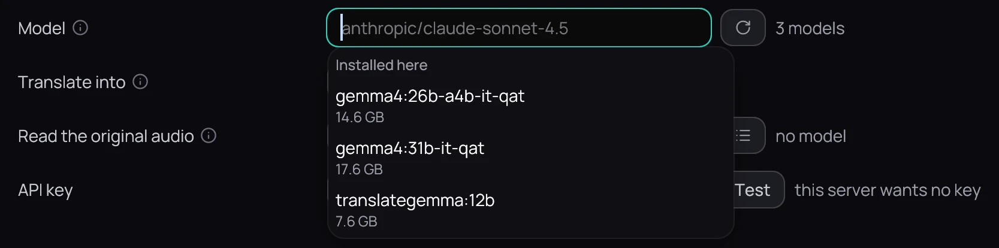
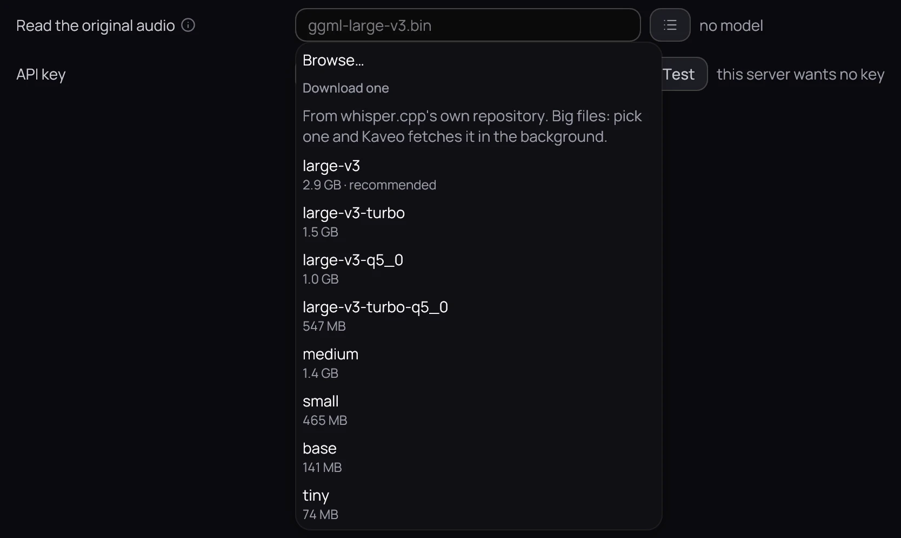

## What it is for

Translate on this computer, and let Kaveo listen to the film's original audio.

## How to use it

### Use a local model

1. Install Ollama or LM Studio, download a model in it, and keep it running.
2. In **Settings › Subtitles › Translation**, choose **Ollama (local)** or **LM Studio (local)** as
   **Provider**.
3. Clear **Model** to see Ollama's models under *Installed here*, with their sizes; pick one and press
   **Save**.

### Listen to the film

1. Install whisper-cli, from whisper.cpp.
2. At the end of the **Read the original audio** row, after the path field, click the list button
   (**Choose a model**) and pick, browse to or download a model.
3. Press **Save** once the row reads *ready*.

## Good to know

- Kaveo listens to a video on this computer before translating it; a second translation of the same
  episode reuses what it heard.
- With Ollama, a model that loads while a film is open can end up on the processor, much slower, and
  stays there until Ollama unloads it.
