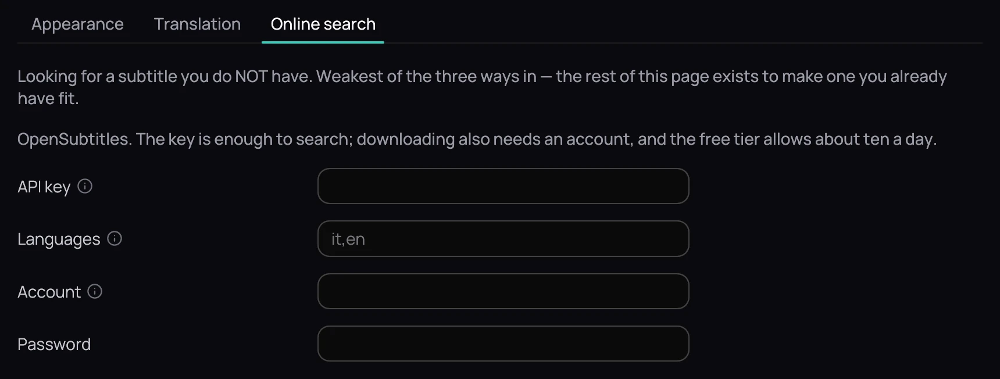

## What it is for

When no subtitle exists beside the video or inside it, Kaveo can search OpenSubtitles for one in your
language.

## How to use it

### Set it up

1. Open **Settings › Subtitles › Online search**.
2. Paste the key from your OpenSubtitles profile, under API Consumers, into **API key**.
3. In **Languages**, list language codes separated by commas, most wanted first.
4. Fill in **Account** and **Password** with your OpenSubtitles sign-in, then press **Save**.

If your computer has no password store, a line under the key and the password says they are kept
only until you restart.

### Search

1. Right-click the picture, open **Subtitles** and choose **Search online…**.
2. To narrow the list, type release words or a language code into the
   *Filter by release, group, quality…* box.
3. Click **Use this**. Kaveo downloads the subtitle, puts it on screen and adds it under
   *Subtitle files*.

## Good to know

- The key alone is enough to search; **Use this** also needs the account.
- The key and password go to your system's credential store, and only when you press **Save**.
