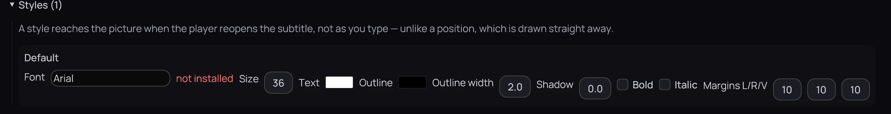
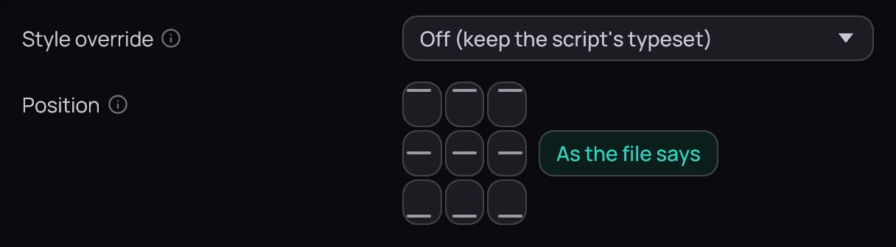

## What it is for

Move a subtitle line, change how a style looks, or move every subtitle at once.

## How to use it

### Place and style a line

1. Only ASS can be placed and styled, so for an SRT or WebVTT file first click **Convert to ASS** in
   the editor or on **All lines…**. Kaveo plays an ASS copy; the original stays.
2. In the editor's **Look** column, click a cell of the *Place* grid, type **X** and **Y**, or drag
   the line on the picture; below, set its **Font**, **Size**, **Colour**, **Outline**, **Shadow**,
   **B** or **I**. *this line* marks a value of its own; the button after it gives it back to the style.
3. Pick **Style «Default»** instead of **This line** to change every line of that style.
4. On **All lines…**, **Styles** lists every style, with margins and transparency.

### Move every subtitle

1. Pick a cell under **Position** in **Settings › Subtitles › Appearance** and click **Save**.
   **As the file says**, then **Save**, undoes it. The editor's **Every subtitle** edits the same
   setting, with its own **Save**.

## Good to know

- The editor's preview draws a line in the typeface the player will use; its outline and effects are close, not exact.
- A style change reaches the picture when you click **Back**.
- If a style change does nothing, set **Style override** in **Settings › Subtitles › Appearance** back
  to **Off (keep the script's typeset)**.
- A red *not installed* beside a font means this computer lacks it, and the player draws another.
