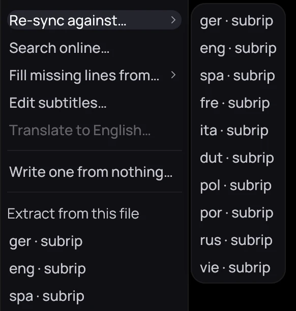
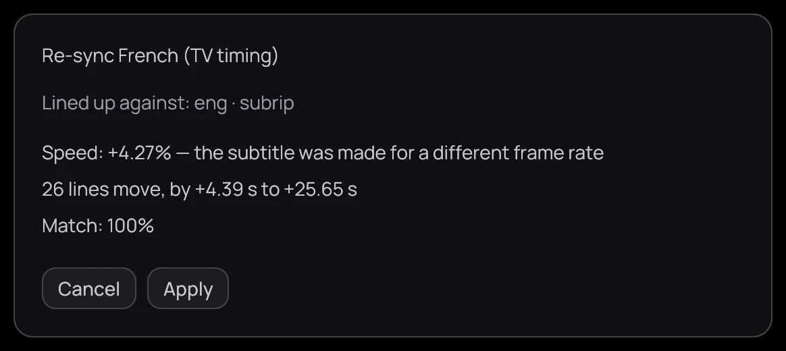

## What it is for

A subtitle made for another edit, such as a TV broadcast, can drift out of time. Line it up against a
video track, or pin two lines by hand.

## How to use it

### Line it up against a track

1. With a subtitle file on screen, right-click the picture, open **Subtitles** and point at
   **Re-sync against…**.
2. Pick any track, even a picture-based one.

### Read what it would change

1. Kaveo reads the whole video and shows what it would change.
2. Click **Apply** or **Cancel**.

### Pin two lines by hand

1. In the subtitle editor, click a line near the start.
2. Play to where it should appear and press **Pin this line here**.
3. Repeat near the end, then press **Fit the speed to the two pins**.

## Good to know

- The subtitle you are syncing must be a file, so a track inside the video has to be extracted first
  — see [Loading subtitles](load.md). The reference can be any track, including a picture-based one.
- **Re-sync against…** is missing on a video with no subtitle tracks, and on a Jellyfin title picking a
  track does nothing yet; the pins work in both cases.
- **Apply** cannot be undone, and a high match only means the lines overlap the reference, not that
  each one landed right. **Undo** reverses a speed fit while the editor stays open.
