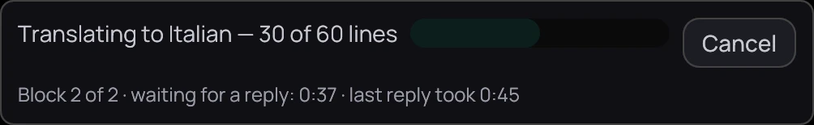

## What it is for

Translate a subtitle with an AI model, online or on your own computer. Each line keeps its timing.

1. **Provider**.
2. **API key**.
3. **Model**.
4. **Translate into**.

## How to use it

### Set up a provider

1. In **Settings › Subtitles › Translation**, choose a **Provider**, or **Other…** and type its
   **Endpoint**.
2. Paste the **API key** if it needs one, and pick or type a **Model**.
3. Type a language in **Translate into**, such as Italian, and press **Save**. If your computer has
   no password store, a line under the key says it is kept only until you restart.

### Translate

1. With a subtitle file on screen, right-click the picture and open **Subtitles**.
2. Choose **Translate to Italian…**, named after your **Translate into** language, or
   **Translate while I watch** to start where the film is.

## Good to know

- A track inside the video has to be extracted first — see [Loading subtitles](load.md). Which model
  to pick: [Choosing a translation model](choosing-a-model.md).
- A panel at the top of the player shows the progress, with **Cancel**; the result is added under
  *Subtitle files*.
- Lines that still fail after Kaveo retries are left in their original language.
- Tick **Re-read the translation** for a second pass that corrects lines saying the wrong thing. It
  helps with a large model; with a small one on your own computer it can add as many mistakes as it
  fixes.
