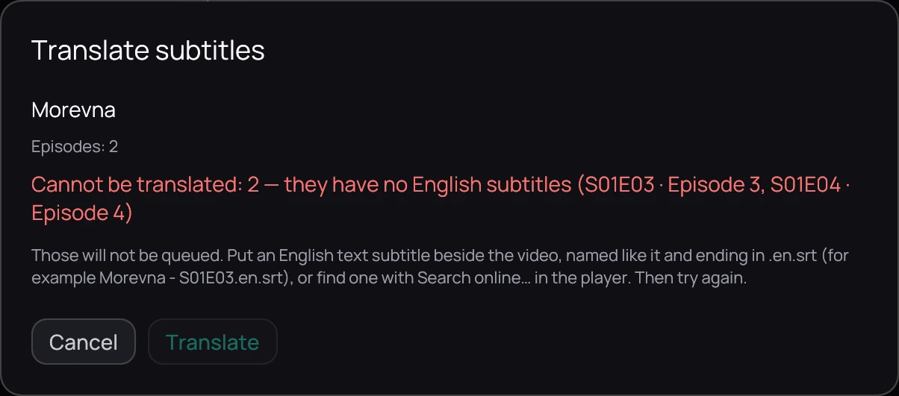

## What it is for

Translate the subtitles of a film, a season or a whole series in one go, without opening the video.
Kaveo works through them one episode at a time, in order.

## How to use it

1. Right-click a film, an episode or a series and choose **Translate subtitles…**. On a series page
   you can also press **Translate subtitles…**, or a season's **Translate this season…**.
2. Check the episodes listed, where their text comes from, and the estimate of time and cost.
3. If some already have a translation, choose **Skip them** or **Translate them again**.
4. Press **Translate**.

## When an episode cannot be translated

Kaveo translates from English text. If an episode's English subtitles are only pictures (PGS), or
missing, the dialog says so in red and does not queue it.

Put an English text subtitle beside the video, with the same name ending in *.en.srt*, or find one
with **Search online…** in the player. Then try again.

## Good to know

- To follow, pause or retry what is queued, see [Following the translation queue](translation-queue-panel.md).
- On a new series, keep **Stop after the first episode** ticked. Check that episode's names, terms
  and speakers, then press **Continue** in the queue: the next episodes use your corrections.
- While a video plays, the queue gives the graphics card back to it and continues when there is room.
- Only video files on this computer can be queued. Set up a provider first: see
  [Translating subtitles](translate.md).
