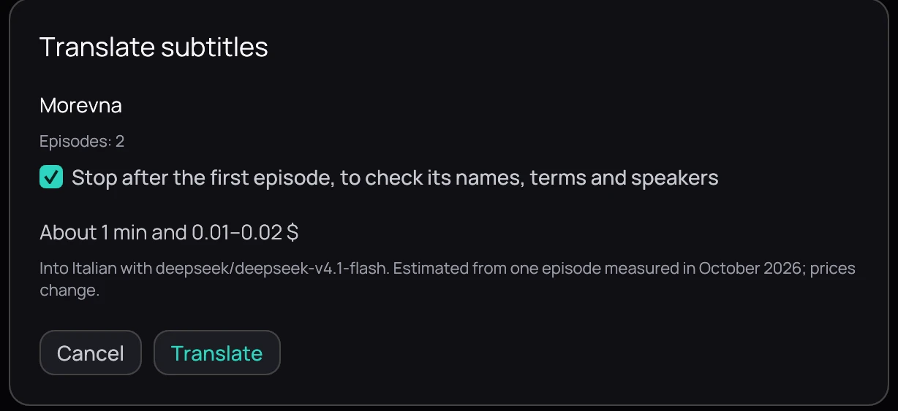
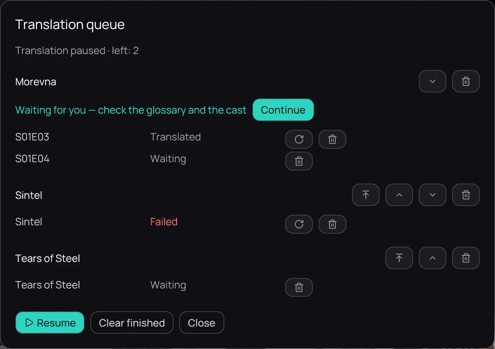

## What it is for

Translate the subtitles of a film, a season or a whole series in one go, without opening the video.
Kaveo works through them one episode at a time, in order.

## How to use it

1. Right-click a film, an episode or a series and choose **Translate subtitles…**. On a series page
   you can also press **Translate subtitles…**, or a season's **Translate this season…**.
2. Check the episodes listed and the estimate of time and cost.
3. If some already have a translation, choose **Skip them** or **Translate them again**.
4. Press **Translate**.

## Following the queue

The top bar shows the queue's progress, for example *Translating 3/9 · 42%*. Click it to open the
queue.

- **Pause** stops after the request in progress; **Resume** goes on from there.
- The arrows change the order of the series; episodes keep theirs.
- The cross cancels the episode in progress; the bin removes an episode or a series.
- The round arrow translates an episode again, or retries one that failed.

## Good to know

- On a new series, keep **Stop after the first episode** ticked. Check that episode's names, terms
  and speakers, then press **Continue** in the queue: the next episodes use your corrections.
- While a video plays, the queue gives the graphics card back to it and continues when there is room.
- A running queue continues when Kaveo starts again.
- Only video files on this computer can be queued. Set up a provider first: see
  [Translating subtitles](translate.md).
