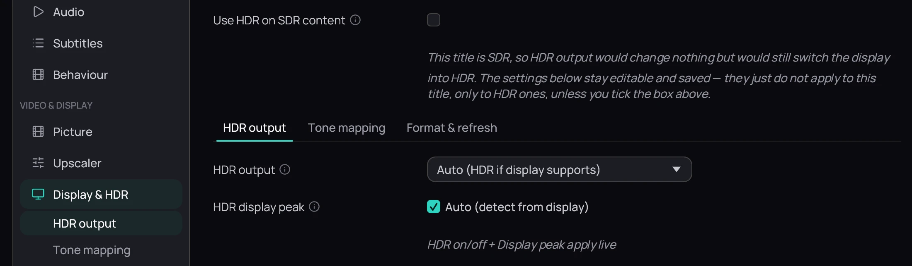

## What it is for

An HDR film carries brighter highlights and richer colour than an ordinary video. Kaveo can send it to
an HDR-capable display so it looks the way it was mastered.

## How to use it

1. While a video plays, press **Ctrl+H** and pick the **Display & HDR** tab, or open
   **Settings › Display & HDR**.
2. Set **HDR output** to **Auto (HDR if display supports)** (the default) or
   **On — strict HDR passthrough**, then click **Save**.
3. For the best result, calibrate first: on Windows, run Windows HDR Calibration (from the Microsoft
   Store) and Kaveo reads the saved value by itself.
4. Otherwise, or if your screen's peak is under 400 or over 2000 nits (Kaveo then assumes 600), untick
   **Auto (detect from display)** under **HDR display peak** (shown only with **Auto**) and set the
   slider to your screen's rated HDR peak by hand.

## Good to know

- HDR engages only while an HDR video plays; Kaveo restores your display when it closes.
- An SDR film never switches the display, unless you tick **Use HDR on SDR content** (off by default).
- On Linux, HDR switches on by itself on KDE Plasma; on other desktops, turn on your desktop's own HDR
  support first.
