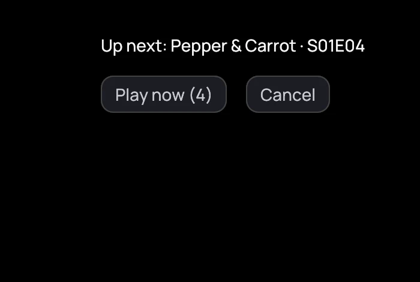

## What it is for

Kaveo plays through a series, an album or a queue you build, and moves on by itself when one item
ends.

## How to use it

### Step through the list

1. Click Previous or Next on the playback bar, or right-click Back 10 seconds or
   Forward 10 seconds, to play the previous or next item.
2. When an item ends and another follows, the *Up next* card counts down: **Play now** starts it at
   once, **Cancel** goes back to the library.

### Build a queue

1. On a title page, click **Play folder** (shown when its folder holds several videos) to play them
   from this one on.
2. From [your file manager](../file-manager.md), choose **Play this folder with Kaveo**, or
   **Add to Kaveo's queue** to add one file to the end.

## Good to know

- **Add to Kaveo's queue** replaces what is playing, unless a queue is running or a file on your
  computer is on screen in the player.
- The next episode keeps the copy you are watching; a queue holds only files on your computer.
- A film opened on its own returns to the library when it ends; a queued one plays on.
