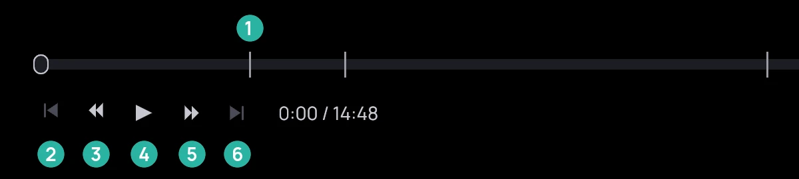
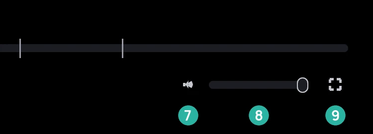
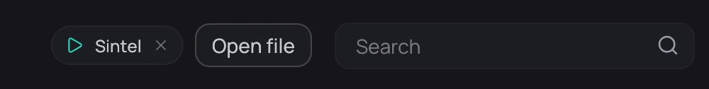

## What it is for

Control playback, and leave the player with or without stopping the film.

1. The timeline: click or drag to jump; its marks are chapters.
2. Previous.
3. Back 10 seconds.
4. Play or pause.
5. Forward 10 seconds.
6. Next; dimmed, like previous, with nothing to step to.
7. Mute.
8. Volume.
9. Fullscreen.

## How to use it

### The playback bar

1. Move the mouse to bring up the bar; it stays up while paused.

### Leaving the player

1. Click **Library** at the top left, or right-click and choose **Back to library**: the film stops
   and its position is saved.
2. Or right-click and choose **Settings**: the film keeps playing, and the logo there leads to the
   library.
3. Click the pill beside **Open file** to return to the player, or its cross to stop the film.

## Good to know

- A right-click on either 10-second button also steps to the previous or next item — see
  [Next episode and queue](next-episode.md).
- A private title's pill shows no name, nor does any pill in a narrow window.
- Closing Kaveo while a film plays saves its position, and so does every pause and every 10
  seconds of playback (for a private title, every pause only). When you open the film again,
  **Resume from 12:34** starts 30 seconds before the point where you stopped.
