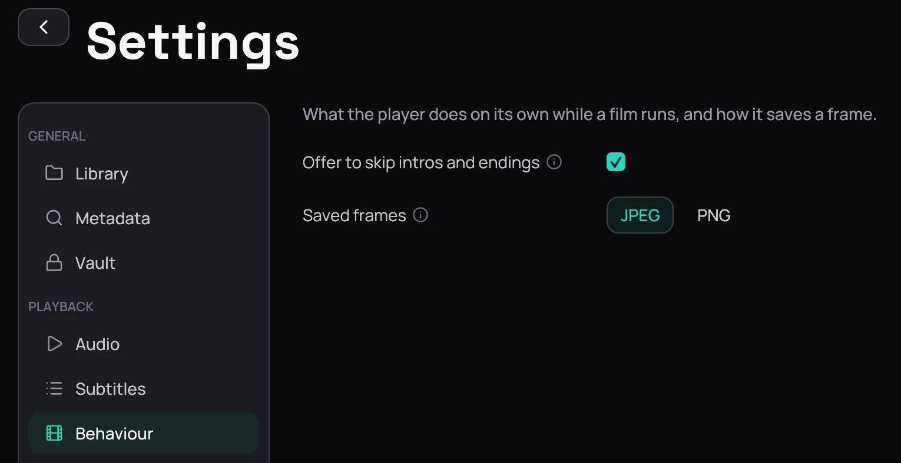

## What it is for

When a file marks its opening, its ending or the scene before the opening as a chapter, Kaveo offers
to skip it, and learns your habit for the rest of that series.

## How to use it

### Skip an opening or ending

1. While the opening, the ending or the scene before the opening plays, click **Skip** in the
   bottom-right corner. Kaveo jumps to a second before the end of that chapter, so
   none of the episode is lost.
2. Skip the same part in two episodes, and the next episodes skip it by themselves. Each
   part is learned on its own.
3. Click **Watch it**, shown for a few seconds each time, to see it after all — Kaveo then offers
   the button again instead of skipping.

### Turn it off

1. Open **Settings › Behaviour** ([Behaviour](../settings/behaviour.md)), untick
   **Offer to skip intros and endings** and click **Save**.
   Kaveo then neither offers a skip nor skips by itself.

## Good to know

- Kaveo goes by the chapter's name (*Opening*, *OP*, *Ending*, *ED*, *Prologue* and similar). When an
  episode's chapters have no names, a chapter as long as a theme song, near the start or at the end,
  is taken as the opening or the ending. Nothing is guessed from the picture or sound.
- An *Intro* chapter just before an *Opening* is the prologue, not the opening.
- Jumping into the opening yourself, with the timeline or arrow keys, is never skipped.
- The choice lasts until you close Kaveo.
