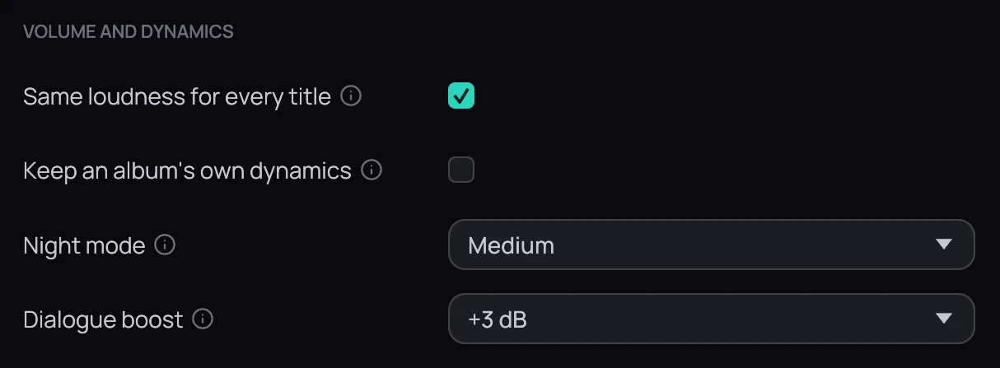

## What it is for

A song, an episode and a film can sound equally loud, a film can be watched quietly at night, and
voices can stand out from the music.

## How to use it

1. In **Settings › Audio**, tick **Same loudness for every title**; your local files are measured in the background while nothing plays.
2. For music, tick **Keep an album's own dynamics** to keep quiet and loud songs of one album apart.
3. Set **Night mode** to **Light**, **Medium** or **Strong** to bring dialogue and explosions closer.
4. Set **Dialogue boost** to **+3 dB** or **+6 dB** to raise the voices.
5. While watching, right-click the picture and open **Sound** to change any of them at once.

## Good to know

- None of them acts on Dolby or DTS sound sent undecoded to a receiver with **Bitstream passthrough**; use the receiver's own controls there.
- **Dialogue boost** needs 5.1 or 7.1 sound: stereo has no separate voice channel.
- The volume slider now goes to 200 %; its middle is the original level.
